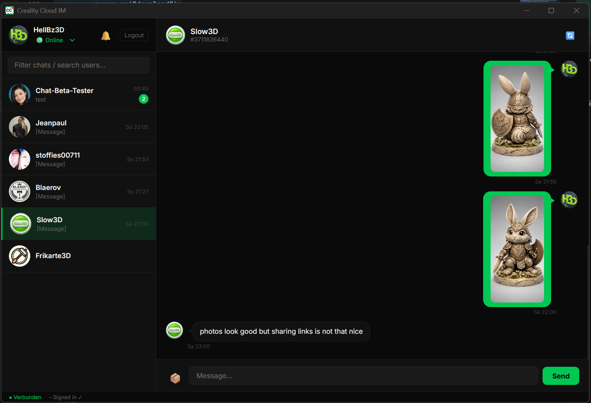

# CrealityIM

A native desktop chat client for **Creality Cloud** messaging, built with [Tauri](https://tauri.app/) and Rust.




## Features

- 🔐 **OAuth Login** via Creality Cloud account (id.creality.com)
- 💬 **Real-time messaging** over WebSocket (Tencent IM)
- 📎 **File & image sharing** with in-app preview
- 🖨️ **3D model sharing** directly from your Creality Cloud library
- 🔔 **Native notifications** for new messages
- 📋 **Contact list** with unread message badges
- ↩️ **Message recall** and local delete
- 🌙 **Dark mode** UI
- 🔄 **Auto-reconnect** with token refresh

## Download

Pre-built installers are available on the [Releases](https://github.com/HellBz/CrealityIM/releases) page:

| Platform | Format |
|---|---|
| Windows | `.exe` (NSIS Installer) / `.msi` |
| macOS | `.dmg` |
| Linux | `.deb` / `.AppImage` |

## Build from Source

### Prerequisites

- [Node.js](https://nodejs.org/) 20+
- [Rust](https://rustup.rs/) (stable)
- On Linux: `libwebkit2gtk-4.1-dev libappindicator3-dev librsvg2-dev patchelf`

### Steps

```bash
git clone https://github.com/HellBz/CrealityIM.git
cd CrealityIM
npm install
npm run tauri build
```

The installer will be at:
- Windows: `src-tauri/target/release/bundle/nsis/`
- macOS: `src-tauri/target/release/bundle/dmg/`
- Linux: `src-tauri/target/release/bundle/deb/` or `appimage/`

### Development

```bash
npm run tauri dev
```

## Tech Stack

- **Frontend**: Vanilla JS / HTML / CSS (no framework)
- **Backend**: Rust + Tauri v2
- **Messaging**: Tencent IM via WebSocket
- **Auth**: Creality Cloud OAuth

## Notes

- Credentials are stored locally using the OS keychain via Tauri's secure storage.
- This is an unofficial client — not affiliated with Creality.

## License

MIT
